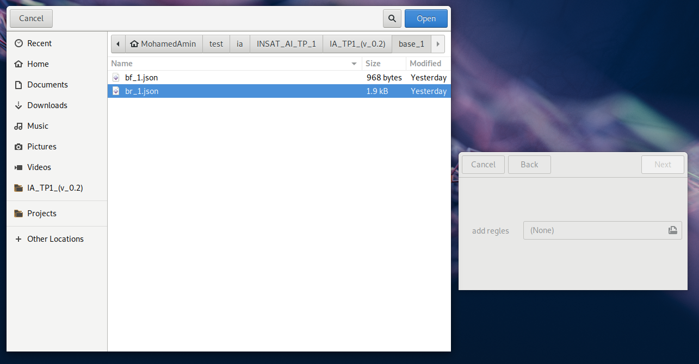
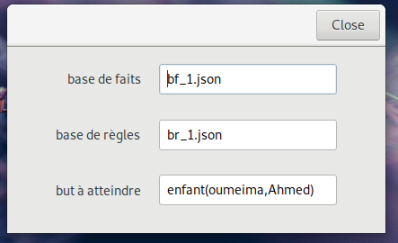
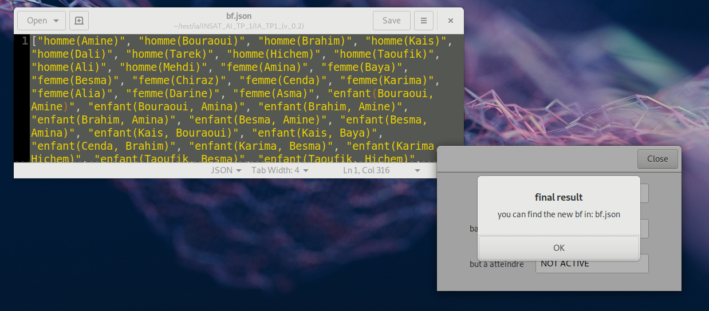

# INSAT_AI_TP_1
code du TP1 intelligence artificielle par: __SAMET MohamedAmin__ & __DGHAIS Ahmed__ GL4/2  

# Requirements
Le code de ce TP est fait sous forme d'une application gui à l'aide du GTK+3.
Pour cela, vous devez installer:
- python 3
- PyGObject [https://pygobject.readthedocs.io] (GTK+3)

# Démonstration
## Démonstration Avec But

## Démonstration Sans But

# Comment ça fonctionne?
- Les données de la base des faits et la base des règles doivent être sous la forme d'un `fichier json`  

- Une foit le on a importé la base des faits et la base des règles, on passe à l'insertion du but.  

- Finalement, on va trouver un résumé. On fait cliquer sur close pour voir le résultat  

    - Si on a inséré un but, le résultat de la recherche du but sera affiché sur le pop-up apparant.  
    

    - Sinon, si le but n'est pas défini, la nouvelle base de faits sera créer dans le répertoir courant.
    
    

